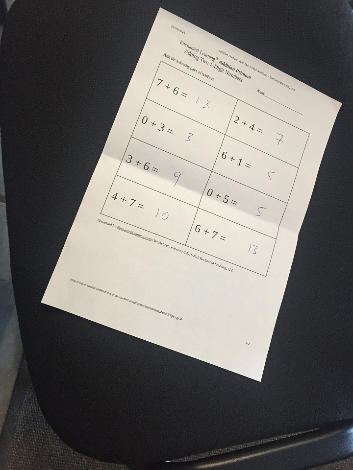

# Computer Vision with Deep Learning

Hello and welcome to this series of tutorials. This is a six-session boot camp to cover the basic concepts of computer vision and gain hands-on experience working on various CV tasks.

First things first, let's differentiate between computer vision and image processing.

Image processing is interested in raw image enhancments via tuning its parameters or applying different filters. When you are doing image processing you are performing tasks such as sharpening, smoothing, bluring, correcting illumination, etc. It can be either an independent task or preprocessing part of a larger task.

Computer vision is a superset of image processing. It is interested in how computers see and process image information to have a proper understanding. That's why it comes along with Machine learning techniques and deep learning to conduct some kind of detection, classification, recognition etc.

What we will focus on during our journey is Deep Computer Vision Using Convolution Neural Networks. But, first we would go through some fundamental concepts such as convolution and filtering. And, we shall practice using openCV library to be able to handle and preprocess image data.

## Table of content:

### [Session 1](./Session1.ipynb):
- Image processing: Overview and applications
- OpenCV Tutorial
- Task 1: Perspective, Affine Transforms and Thresholding
### [Session 2](./Session2.ipynb):
- Image processing: Convolution, Cross Correlation and Fitlers
- Convlution Neural Network: Motive and overview
- Filters and pooling
- CNN Tutorial
- Task 2: Improving model performance on CIFAR 10
### [Session 3](./Session3.ipynb):
- Convolution Neural Network: key points Summary and model development
- Image data preprocessing & Data augmentation
- CIFAR 10 dataset baseline model with VGG block
- Regularize deep complex models (Dropout, Regularization, Data Augmentation) 
- Task 3: Which techniques combination with best hyperparameters approaches 90 % test accuracy ?
### Session 4:
- CNN architectures
- ResNet-34 tutorial
- Transfer learning
- Task 4:
### Session 5:
- Detection, recognition, identification 
- Object detection
- Semantic segmentation
- Task 5:
### Session 6:
- Capstone Project

## Assignments:

### Assignment 1:

Do you know the famous camscanner app? You can use it as an image scanner getting high quality images with the correct prespective./

You are asked to do the following operations over the `scan.jpg` image above:
- Get the correct prespective
- Convert it to binary (black and white) using thresholding on grayscaled image

For the first task, you can first the utilize the following information to use `cv2.getPerspectiveTransform` and `cv2.warpPerspective`

Cordinates of the 4 corners of the original image --> points_A = np.float32([[320,15], [700,215], [85,610], [530,780]]) *can you get them interactively by mouse clicks?*

Cordinates of the 4 corners of the desired output using a ratio of an A4 Paper 1 : 1.41 --> points_B = np.float32([[0,0], [420,0], [0,594], [420,594]])

### Assignment 2:
### Assignment 3:
### Assignment 4:
### Assignment 5:
### Assignment 6:

## Feedback

### Pace, organization, sufficient material
### LOs
### Instructor

